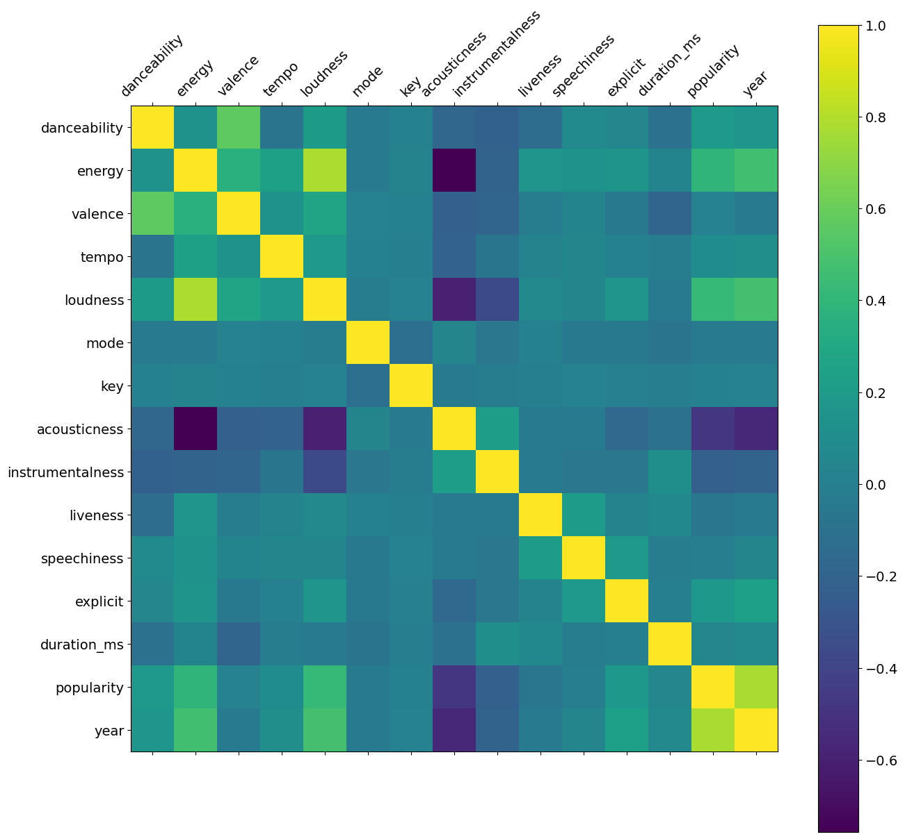
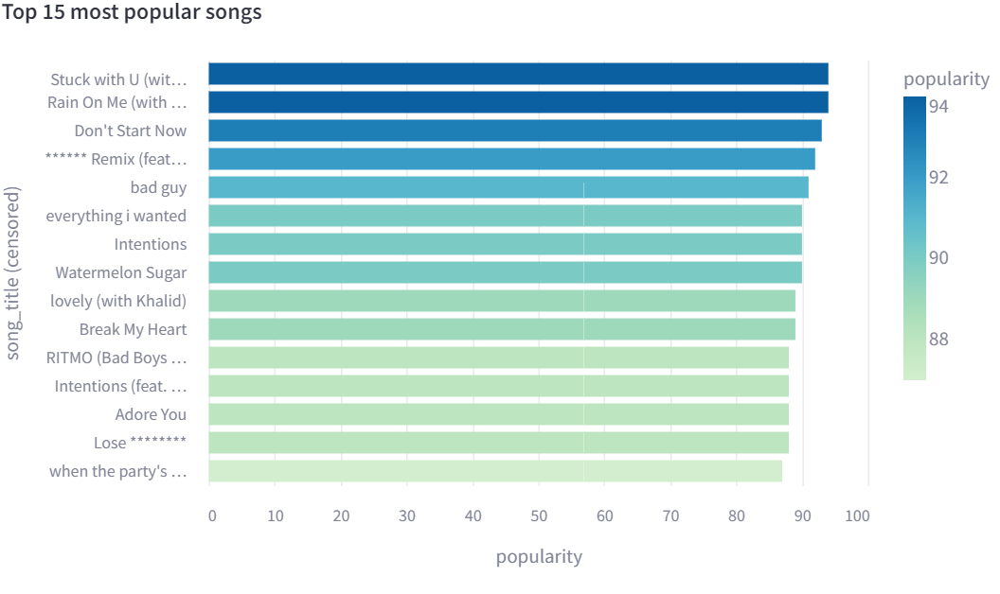
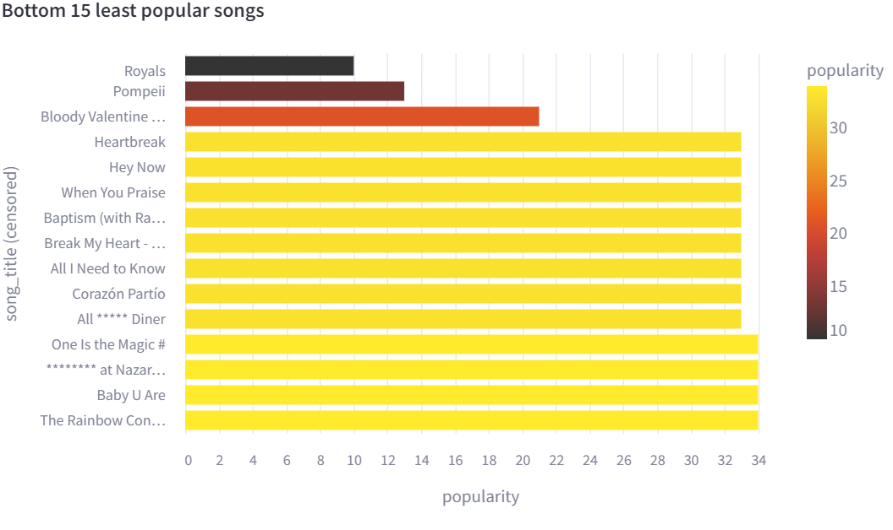
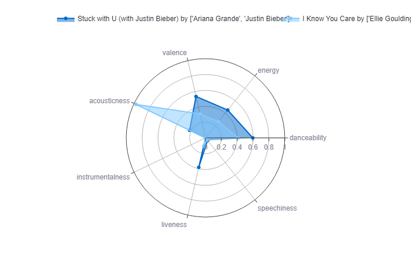
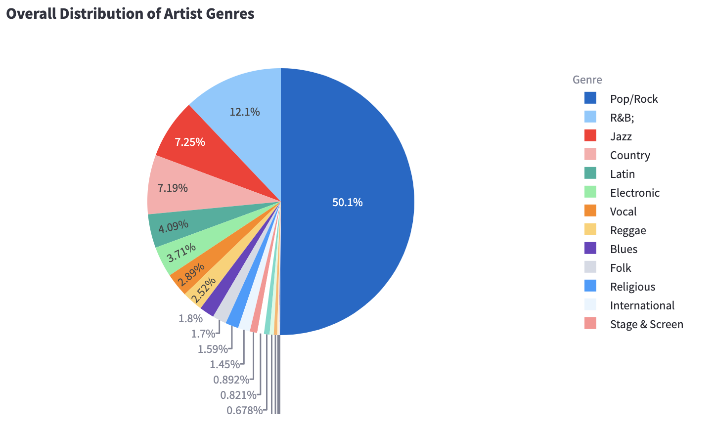
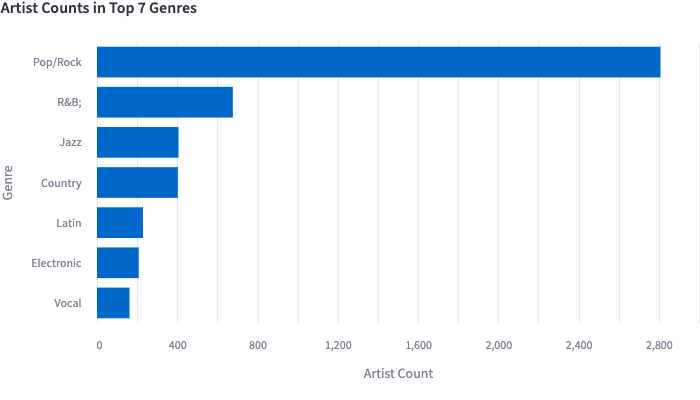
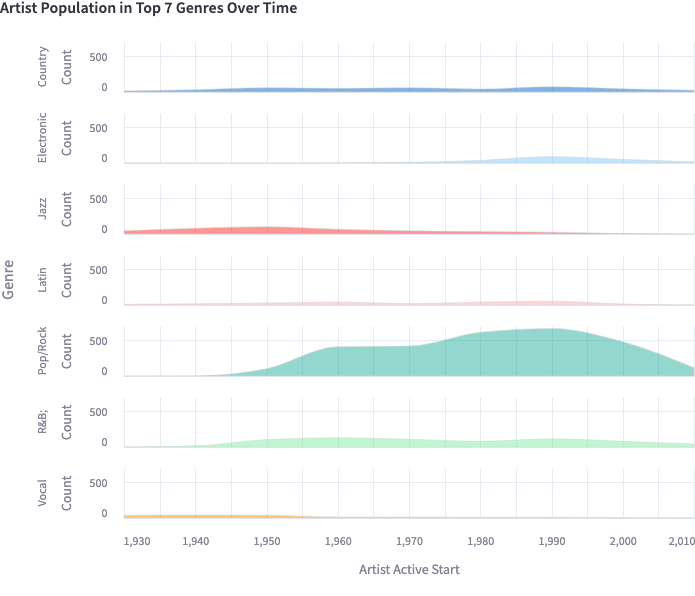
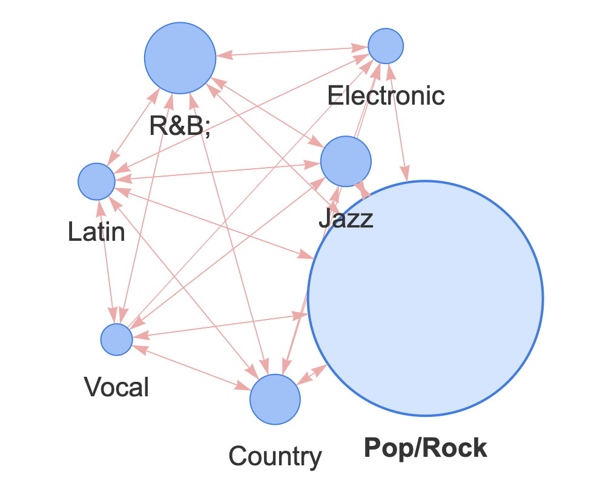
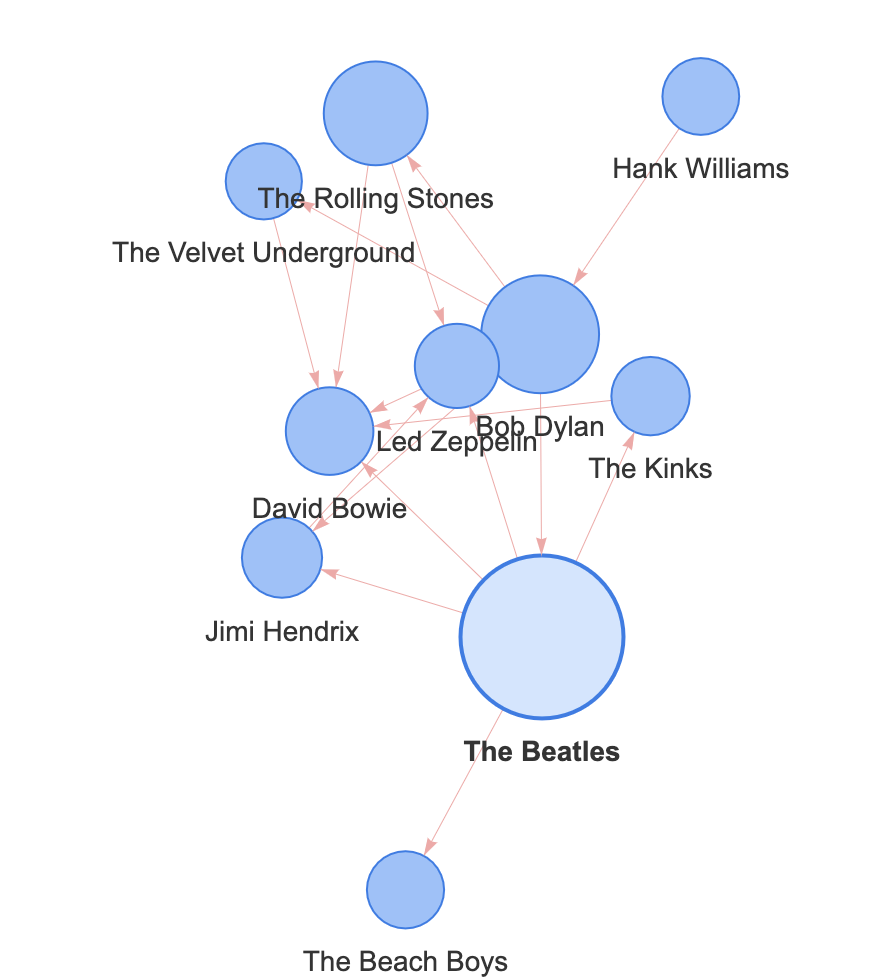

# Final Project Report

**Project URL**: TODO
**Video URL**: TODO

## Abstract

The data science problem addressed in this project is the exploration and understanding
of the evolution of music over time using a curated dataset from the Interdisciplinary
Contest in Modeling (ICM) for Problem D in 2021. The dataset encompasses various
characteristics of music, such as acousticness, energy, instrumentalness, loudness,
tempo, explicitness, and frequency of musical keys, among others. The objective is
to gain insights into music trends, artist characteristics, and the influence of
past music on new compositions.

The Streamlit application developed for this purpose consists of four main sections:
Data by Year, Data by Artist, Data by Song, and Music Influence. In the Data by Year
section, informative visualizations are presented to highlight trends and changes
in music characteristics over different decades, accompanied by explanations of
significant events influencing these trends. The Data by Artists section provides a
characteristic overview of each artist, allows comparison between artists, and
ranks artists by greatest and smallest popularity. The Data by Song section allows users
to explore the dataset comprehensively through three tabs, offering an overview of
the dataset, ranking songs based on popularity, and comparing individual songs across
various attributes. The Music Influence section delves into influencer-follower
relationships among artists, employing innovative techniques such as the "pivot-melt"
approach for constructing stacked distribution charts and incorporating interactive
network visualizations.

Our solution effectively addresses the problem by providing a user-friendly interface
that facilitates in-depth exploration of the dataset, enabling users to uncover patterns,
correlations, and influential factors in the realm of music. The incorporation of
diverse visualizations and interactivity enhances the user experience and contributes
to a comprehensive understanding of the multifaceted aspects of music over time.

## 1 Introduction
Music has been an integral part of human societies for centuries. As part of an
effort to understand the role of music in the collective human experience, we
used the curated dataset from the Interdisciplinary Contest in Modeling (ICM)
for Problem D in 2021 and developed a Streamlit application to visualize music
evolution. There are many influence factors for music creation, such as the
artist's own personal experience, social events, or access to new pieces of
technology. Our goal is to understand the evolution of music from multiple
perspectives, including time series, artist characteristics, song
characteristics, and measure the influence of previously produced music on new
music and artists. 

## 2 Related Work

For this application's Data by Year page, we incorporated information that
aims to provide some context for trends in the data. We researched
the history of Western music in the 20th century, as Western music makes up the 
bulk of this dataset. The sources we used for contextual information to explain
these trends are cited at the bottom of each page if any sources were used.
The trajectory of our research was dictated by first inspecting the trends in 
the Data by Year dataset, picking out notable changes in the trends (e.g., a large
change in the values for acoustics starting in the 1950s), and using that as
a starting point for events to look into.

## 3 Methods

### 3.1 Data by Year
This page inspects the Data by Year dataset, which aggregates the music characteristic
values of all songs in the dataset released in the same year. Below, we discuss
the content shown on this page and the layout design.

#### 3.1.1 Page Content
This page was meant to be more of an informative / educational one rather than
one focused on interactive visualizations as this particular dataset was limited
in how much granularity it contained. We focused on the strongest trends we
observed in this dataset through EDA and dedicated a visualization to each trend
followed by an explanation of the events or developments in certain time periods
that may have contributed to those trend changes. We discussed the rise of electronic
music, dominant keys, changes in tempo and loudness, and a new feature we created
from the full dataset called "explicitness," which measures the proportion of songs
from each year which contain explicit lyrics. 

#### 3.1.2 Page Design
This page contains six different visualizations, each with an accompanying "Data" 
tab so that the data plotted in each visualization is available to the user if they
wish to use it without cluttering the page with tables.

The first visualization illustrates the rapid and sustained changes in the features
acoustics, energy, and instrumentalness in the decades between the 1950s and 1980s.
The plot is followed by our hypothesis of what caused this trend. This format of
plot-explanation pairings are repeated for the next four visualizations that
display loudness, tempo, explicitness, and frequency of musical keys.

The last visualization on this page is an interactive one where the user can select
a number of the features in this dataset to display on one chart in the time range
of their choice. To standardize the scale of this plot, we limit the 
choices of features to those with a range of 0 to 1. 

### 3.3 Data by Song
This section summarizes our steps for data cleaning, design choices, and developing a Streamlit application for the Data by Song page. 

#### 3.3.1 Data Cleaning
The dataset we used in this section is the full music dataset that contains
information for 98,340 songs released between 1921 and 2020. Since we obtained
the dataset from ICM, it has already been sufficiently cleaned. To adapt the
data for use in our Streamlit application, we made minimal changes to the data,
such as converting datatypes of specific columns. 

#### 3.3.2 Page Design
To effectively and thoroughly understand the data, we decided to use three tabs
within this page: an overview tab, a song ranking tab, and a song comparison
tab. 

First, the **overview tab** is a static tab that shows the user the original
dataset, statistics of numerical features of the original dataset, such as
min, max, and standard deviation, and a correlation matrix of the numerical
features in the dataset. We used this tab as an introduction, allowing the user to examine the data directly. We hope this static
introduction will help the users appreciate the interactivities in other tabs
more.

Next, the **song ranking tab** will allow the user to see the most and least
popular songs in the dataset. The user can filter songs by date,
choose how many songs to display, and set the minimum and maximum popularity of
songs to be displayed. We used Altair to create two horizontal bar plots, plotting the top and bottom simultaneously and color coding the popularity, allowing the user to easily visualize the difference in popularity. 

Lastly, the **song comparison tab** will allow the user to freely choose up to 6
songs in the dataset and compare their characteristics. The reason we decided on
6 songs are for aesthetic reasons, as more songs in the visualization make it harder to distinguish. The visualization we decided to use is a polar
graph with a plot, which can easily allow the comparison of multiple entries with
multiple numeric features. For the convenience of song searching, we sorted the
dataset by song title and concatenated the artist names to the end of the song
title so that users can search songs by title or artist. 

#### 3.3.3 Development
We used Streamlit as our main framework for creating the application. In the
Data by Song page, we also used Python libraries, including pandas, for data
processing, matplotlib, Altair, and plotly for creating visualizations. More
specifically, matplotlib was used to create the static correlation matrix in the
overview tab, Altair was used to create the dynamic song ranking bar plot and
plotly was used to create the dynamic song comparison polar plot. 

### 3.4 Music Influence
#### 3.4.1 Data Preparation
The influence dataset proves to be pretty neat without null values or duplicates. There are two unique attributes of this dataset. Firstly, it contains 42770 influencer-follower relationships. Secondly, this dataset has a "main genre" feature associated with each artist, which is found in no other datasets. To best leverage both, we analyze the data at the " genre " and "influencer" levels. When computing statistics at the genre level, "influencers" and "followers" are "equivalent"- both are artists. So, we prepare a "full_artists" data frame that vertically stacks influencer and follower data. When focusing on the influencer level, we aim to answer questions like "Who is the most impactful artist of all time?" Thus, we prepare another "influencer" data frame, extracting information only regarding the influencers. With these datasets prepared, we efficiently pave the way for the following steps. 

#### 3.4.2 Key Techniques
Among various data manipulation techniques, the most creative must be the "pivot-melt" approach for constructing the "Artist Population In Top N Genres Over Time", a stacked distribution chart. Pivot table is an efficient technique to re-structure our data frame so that one of its column contents may be pivoted as the row, making subtotal/total summary extra convenient. After we obtain this summary pivot table, we "melt" it to conform to the input standard of Altair, reformating a wide data frame to a long one. These transformations make our analysis flexible and efficient. 

#### 3.4.3 Visualization Highlight
One highlight of this section is our incorporation of network visualizations. A network is a graph consisting of nodes and edges. Our research shows various ways to visualize a network via libraries such as "networkx", "pyvis", etc. To cater to the interactive nature of our app, however, we choose a library that 1) is compatible with Streamlit 2) is fun to interact with. "streamlit-agraph" perfectly meets our criteria. It not only allows users to add nodes and edges with customized attributes but also provides an interactive interface where users could "drag" the network around to inspect the details. We implemented networks for both genres and artists for the audience to fully explore the dynamics.

## 4 Results

### 4.3 Data by Song
The visualizations we produced on this page help with exploring the relationship
of different numerical characteristics of different songs. 

#### 4.3.1 Overview tab:
This is the correlation matrix shown in the overview tab. This graph, although
static, contains condensed information that clearly shows the relationship
between different features in the entire dataset. This visualization can answer
the preliminary question of what factors of music are closely correlated.

#### 4.3.2 Song Ranking tab:
This is an example of the visualization created in the song ranking tab for top
songs ranking. The date range for this graph is from 2000-1-11 to 2020-6-16,
with a k of 15 and a maximum popularity of 94. 

This is an example of the visualization created in the song ranking tab for
the bottom songs ranking. The date range for this graph is from 2000-1-11 to
2020-6-16, with a k of 15 and a minimum popularity of 10.

The song rankings graphs allow the users to have a clear sense of what the
popular music is. The graph also dynamically displays the relevant information
including popularity and year for each song, if the user hovers over the bar for
the song. Having the top-ranking and bottom-ranking songs side by side allows the user to investigate the difference between popular and unpopular songs. It allows the user to discover the trends themselves.

#### 4.3.3 Song comparison tab:
This tab allows the user to dive deep into the differences in characteristics of individual songs. It allows the user to select songs and compare their detailed characteristics. The application will also dynamically display the popularity of the hovered song. This allows the user to investigate how songs with different popularity differ exactly in terms of their characteristics, which allows the user to explore how features affect a song's popularity.

This is an example of the visualization created in the song comparison tab. The
two songs chosen are "Stuck with U (with Justin Bieber) by ['Ariana Grande',
'Justin Bieber']" and "I Know You Care by ['Ellie Goulding']". The reason for
choosing the two songs because they have distinct characteristics and show up
very differently in song ranking.

### 4.4 Influence Data
The visualizations your system produces and any data to help evaluate your approach. For example, you might describe a case study illustrating how your visualization(s) or algorithm(s) address your chosen problem.
#### 4.4.1 Overview tab

This graph answers the question, "what is the mainstream genre during a particular period of time?" To find the answer, use the slide bar to fix a period of time and observe the majority of genres in the pie chart. For instance, we could see that "Pop/Rock" has been an overall mainstream genre of music.
#### 4.4.2 By Genre tab

This bar chart gives us a more quantitative overview of top n genre distribution. With it, we could answer questions such as "Is there an overwhelming genre? If so, how often is it larger than the second popular genre?" During 1930-2010, for instance, we could observe that "Pop/Rock" is such a majority class that it has more than 5 times more artists than the second popular genre, "R&B".

This stacked distribution chart helps us answer questions such as "What is the development trend of a genre? And when did it reach a peak?" Take "Pop/Rock," for instance; it accelerated the increase from 1950 to 1960, reached a plateau from 1960 to 1970, and surged to a peak around 1990. It then displays a decreasing trend yet still maintains the dominant genre.

This network graph helps us answer the question, "How does one genre influence the other?" For instance, when we focus on the top 7 genres, the mainstream genre "Pop/Rock" influences every other genre. While a less popular genre, "Electronic", influences every other genre except "Vocal", "Jazz", and "Country".

#### 4.4.3 By Artist tab

This network graph allows us to answer the question, "Who has been the most dynamic influencer?" According to the network, The Beatles has been the central influence on many top artists such as David Bowie, Jimi Hendrix, etc. On the other hand, Hank Williams is a relatively "isolated" artist focusing on Country music, only influencing Bob Dylan among the top 10 artists.

## 5 Discussion

## 6 Future Work
In the future, we will improve our application in the following directions.
For the data by-year dataset, social & historical background would be incorporated with current time series analysis to show the relationship between social events and major music revolutions.
For the data by artist dataset, we discovered that the same artist could correspond to multiple main genres and start years. Could this indicate an artist's style shift throughout his/her career? We could look closer to visualize and analyze who has been the most dynamic artist with the most versatile styles.
We could cluster the songs by their principal attributes and inspect the clusters for the data-by-song dataset to find high-level patterns. What makes a cluster distinct? Are the songs in one cluster sharing the time period, artist, or style? Would this cluster overlap with the artist genre classes?
For the music influence data, we could extend by adding artist images in the network nodes. To do this, we could either search for a comprehensive database with artist-image url data or scrape the web for artist images. In addition, we could find some ways to incorporate genre into the artist network. For instance, using differen colors for the nodes to denote the genres. This would merge genre and artist information to give a more holistic view.

## 7 Reference

Below is a list of references that includes our data source as well as websites
we referenced for domain information.

Get tracks’ audio features. Web API Reference | Spotify for Developers. (n.d.). https://developer.spotify.com/documentation/web-api/reference/get-several-audio-features 

2021 ICM Problem D - Mathmodels.org. Mathmodels.org. (n.d.). https://mathmodels.org/Problems/2021/ICM-D/2021_ICM_Problem_D.pdf 

Wikimedia Foundation. (2023, November 19). Synthesizer. Wikipedia. https://en.wikipedia.org/wiki/Synthesizer 

ChrisDelClea. (n.d.). GitHub - ChrisDelClea/streamlit-agraph: A Streamlit Graph Vis. GitHub. https://github.com/ChrisDelClea/streamlit-agraph

pandas.pivot_table — pandas 2.1.3 documentation. (n.d.). https://pandas.pydata.org/docs/reference/api/pandas.pivot_table.html

pandas.DataFrame.melt — pandas 2.1.3 documentation. (n.d.). https://pandas.pydata.org/docs/reference/api/pandas.DataFrame.melt.html#pandas.DataFrame.melt

altair.Row — Vega-Altair 5.2.0 documentation. (n.d.). https://altair-viz.github.io/user_guide/generated/channels/altair.Row.html

plotly.express.pie —  5.18.0 documentation. (n.d.). https://plotly.com/python-api-reference/generated/plotly.express.pie

